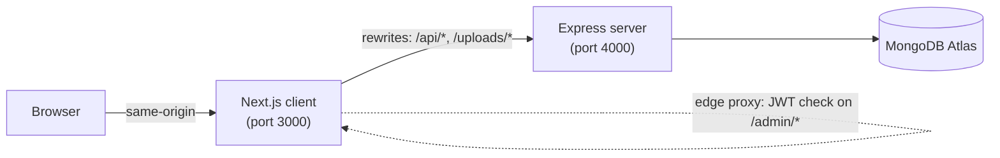

# Architecture

How CasaStruct is put together, what's used where, and why. For day-to-day
admin usage see [ADMIN.md](ADMIN.md); for install/run steps see the
[root README](../README.md).

## Overview

Two independently deployed apps share one MongoDB Atlas database:



- **`client/`** — the public website *and* the admin UI. Next.js renders
  public pages server-side (fetching from the Express API at build/request
  time) and also hosts the entire `/admin` panel as client components calling
  that same API.
- **`server/`** — a plain Express + Mongoose REST API. It owns all data,
  authentication, and image processing. It has no knowledge of Next.js.
- **MongoDB Atlas** — one database, shared. Only the server talks to it
  directly.

The browser **never calls the Express server directly**. `client/next.config.ts`
rewrites `/api/*` and `/uploads/*` to the backend server-side, so from the
browser's point of view everything is same-origin. This is what lets the
admin session cookie work as a normal first-party `httpOnly` cookie with no
CORS/cross-site-cookie complications — and it mirrors how production is set
up (one public domain, reverse-proxied to two backend processes).

## Repo layout

```
client/src/
  app/
    (site)/            # public routes: /, /services, /plans/[slug], /blog, /about, ...
    admin/
      login/            # /admin/login (outside the authenticated layout)
      (dashboard)/       # every authenticated admin route
    api/revalidate/     # POST-only route; on-demand ISR cache busting
  components/
    admin/              # admin UI — forms, lists, shared factories (see below)
    <feature>/           # public-site components, grouped per page (home/, about/, blog/, ...)
  lib/
    api.ts               # server-side reads (Server Components) — API_URL, ISR
    admin-api.ts          # client-side admin CRUD calls — relative /api/* paths
    admin-auth.ts          # login/logout/me calls
    admin-session.ts        # JWT verification shared by proxy.ts and /api/revalidate
    content/                 # TypeScript types only (Service, Plan, Post, ...) — no data
    site.ts, rates.ts          # static config + fallback defaults
  proxy.ts                # Next 16's edge "proxy" (formerly middleware) — gates /admin/*

server/src/
  index.ts              # app entrypoint — express setup, route + middleware mounting
  db.ts                  # mongoose connection
  models/                 # one file per collection
  routes/                  # one file per resource, usually built from a factory (below)
  lib/
    crudRouter.ts           # factory: the standard slugged-resource CRUD router
    singletonRouter.ts        # factory: the standard "one document" router
    asyncHandler.ts             # wraps async handlers so rejections reach the error middleware
    auth.ts, slug.ts, images.ts, imageCleanup.ts
    storage/                     # pluggable image storage (local disk today; Cloudinary planned)
  middleware/
    requireAdmin.ts          # gates admin-only routes on the session cookie's JWT
    errorHandler.ts            # terminal error middleware
  scripts/                # one-off CLI scripts: seed:admin, seed:services, seed:plans, ...
```

## Tech stack

### Client (`client/`)

| Package | Used for |
| --- | --- |
| **Next.js 16** (App Router) | Routing, Server Components, ISR, the edge `proxy.ts` convention, rewrites |
| **React 19** | UI |
| **TypeScript** | End to end, `strict: true` |
| **Tailwind CSS v4** | Styling |
| **motion** (Framer Motion) | Scroll-reveal and count-up animations (`Reveal`, `Counter`) |
| **lucide-react** | Icons |
| **jose** | Edge-compatible JWT verification (`proxy.ts`, `/api/revalidate`) — `jsonwebtoken` isn't edge-runtime safe |
| **marked** | Renders admin-authored Markdown blog content to HTML |
| **clsx** / **tailwind-merge** | Conditional/merged class names |

### Server (`server/`)

| Package | Used for |
| --- | --- |
| **Express 4** | HTTP framework |
| **Mongoose** | MongoDB models/queries |
| **zod** | Request validation — every write route parses `req.body` through a schema before touching the DB |
| **jsonwebtoken** | Signs/verifies the admin session JWT |
| **bcryptjs** | Password hashing (12 rounds) |
| **helmet** | Security headers |
| **cors** | Locked to `CORS_ORIGIN` (defense in depth — the browser only ever hits this same-origin via the Next.js rewrite) |
| **cookie-parser** | Reads the `httpOnly` session cookie |
| **express-rate-limit** | A baseline limiter on all of `/api/*`, plus tighter limits on `/auth/login` and public `/inquiries` submission |
| **multer** | Buffers uploaded images in memory |
| **sharp** | Re-encodes every upload to capped-width WebP — strips EXIF and any payload smuggled in the original file, and caps decode pixels against decompression-bomb images |
| **slugify** | Generates unique, URL-safe slugs from titles |

## Authentication

- Login (`POST /api/auth/login`) checks email + bcrypt-compared password,
  then signs a JWT (`{ sub, email }`, HS256, 7-day expiry) and sets it as an
  `httpOnly`, `sameSite: lax` cookie (`Secure` when `NODE_ENV=production`).
- **Two independent verifiers, one secret.** The Express server verifies the
  cookie with `jsonwebtoken` in `requireAdmin` middleware (gates every
  admin-only API route). The Next.js side verifies the *same* cookie with
  `jose` in `proxy.ts` (gates rendering of `/admin/*` pages) and in
  `/api/revalidate` (gates on-demand cache busting). Both sides pin the
  algorithm to `HS256` and must share the exact same `JWT_SECRET`.
- There is no public sign-up route. Admin accounts are created via the
  `npm run seed:admin` CLI script only.

## Data flow & caching

Public pages are Server Components that call `lib/api.ts`, which fetches
from the Express API with Next's time-based revalidation
(`next: { revalidate: 30, tags: [...] }`). That alone would mean admin edits
take up to 30 seconds to appear — instead, every admin write also calls
`POST /api/revalidate { tags: [...] }` (see `lib/admin-api.ts`'s `revalidate`
helper), which busts the relevant tag immediately (`revalidateTag(tag, { expire: 0 })`).
So edits show up on the next request in practice, with the 30s window only as
a fallback if that on-demand call ever fails (it's fire-and-forget by design —
a revalidation hiccup must never block the admin's save).

If the Express API is unreachable, every public read in `lib/api.ts` catches
the failure and falls back to an empty list (or hardcoded defaults for
`SiteSettings`/`CalculatorRates`) rather than throwing — a backend hiccup
degrades the public site instead of crashing it.

## Server-side design: two router factories

Every admin-managed resource follows one of two shapes, so instead of
hand-writing CRUD per resource, two factories build the router:

- **`createCrudRouter`** (`lib/crudRouter.ts`) — the standard shape used by
  Services, Plans, Projects, Blog Categories/Posts, Digital Product
  Categories/Products: public `GET /` (sorted) + `GET /:id`, admin
  `POST`/`PUT` (auto-slug via `uniqueSlug`, zod-validated) + `DELETE`
  (with image cleanup). A few resources need small variations — a
  category-reference check, a query filter, an admin-only detail route —
  which the factory takes as optional hooks (`refCheck`, `listFilter`,
  `adminList`, `detailRequiresAdmin`) rather than each resource
  reimplementing the whole router by hand.
- **`createSingletonRouter`** (`lib/singletonRouter.ts`) — for the two
  "one document" resources, Calculator Rates and Site Settings: `GET /`
  (lazily creates the document on first read) + admin `PUT /` (upsert).

Every route handler is wrapped in `asyncHandler` (`lib/asyncHandler.ts`), so
a rejected promise (e.g. an invalid MongoDB id throwing a `CastError`) reaches
the terminal `errorHandler` middleware instead of hanging the request or
crashing the process.

## Client-side design: shared admin UI primitives

The admin panel has the same "one CRUD screen per resource" shape repeated
eight times, built from shared components in `components/admin/`:

- **`AdminResourceList<T>`** — the list screen: fetch, loading/error/empty
  states, thumbnail rows, a "New X" button, delete with confirm. Every
  `*-list.tsx` is a ~25-line wrapper supplying just the data accessors.
- **`AdminFormShell`** — the create/edit screen chrome: back link, heading,
  error box, submit/cancel buttons. Every `*-form.tsx` supplies its own
  fields and submit handler.
- **`useResource` + `ResourceLoader`** — load-by-id plus loading/error
  rendering, shared by every `edit-*.tsx` wrapper.
- **`CardGrid<T>`** — the public site's responsive 2/3/4-column card grid
  with staggered scroll-reveal, shared by the Services, Plans, Digital
  Products, and Blog grids.

## Image upload pipeline

1. Admin picks a file in `ImageUploader` / `MultiImageUploader` → uploaded
   immediately via `POST /api/admin/upload` (multipart, `requireAdmin`-gated).
2. `multer` buffers it in memory (8 MB cap, mimetype allowlisted to
   jpeg/png/webp/avif/gif — not a broad `image/*`).
3. `sharp` re-encodes it: respects EXIF rotation, caps width at 1600px,
   caps decode pixels (~40MP) against decompression-bomb images, strips all
   metadata, outputs WebP at quality 80, and generates a random filename.
   **This step is also the security boundary** — nothing resembling the
   original uploaded bytes is ever written to disk.
4. `storage.save()` writes it (currently `LocalDiskStorage`, under
   `server/uploads/`, served by Express's `/uploads` static route). The
   `ImageStorage` interface (`lib/storage/types.ts`) is the seam for adding a
   Cloudinary/S3/GCS driver later without touching any route.
5. On replace/delete, `storage.remove()` cleans up the old file(s) —
   best-effort; a disk hiccup here must never fail the DB write that already
   succeeded.

## Security measures in place

- zod validation on every write route (acts as a field allowlist — no mass
  assignment of fields like `role` or `passwordHash`).
- Rate limiting: baseline on all of `/api/*`, tighter on login and public
  inquiry submission.
- JWT pinned to `HS256` on both verifiers (no algorithm-confusion surface).
- Path-traversal guard on local image deletion (rejects any resolved path
  outside the uploads root, with a `path.sep`-safe boundary check).
- `helmet` (server) + `X-Frame-Options` / `X-Content-Type-Options` /
  `Referrer-Policy` (frontend, via `next.config.ts`).
- No secrets committed; `.env`/`.env.local` gitignored everywhere.
- Untrusted input (public inquiry submissions) is only ever rendered via
  plain JSX interpolation in the admin dashboard — React escapes it
  automatically. The one `dangerouslySetInnerHTML` (rendering blog Markdown)
  is admin-authored content only, with no public submission path.

## Deployment topology

Both apps run as separate Node processes (e.g. via PM2), typically on the
same host, reverse-proxied under one public domain. See the
[root README](../README.md#deployment) for the required production
environment variables.
